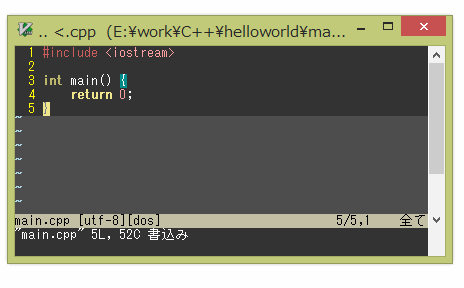

# kuririn-no-kotoka.vim
=======================

あなたがサイヤ人なら、Vimはスーパーサイヤエディタになる


## DEMO





## Install

```vim:.vimrc
NeoBundle 'wordijp/kuririn-no-kotoka.vim'
```

以下のライブラリに依存しています
* [Shougo/vimproc.vim](https://github.com/Shougo/vimproc.vim)
* [osyo-manga/vim-sound](https://github.com/osyo-manga/vim-sound)


## Usage

あなたがサイヤ人なら

```
:KuririnNoKotokaEntrySaiyajin
:KuririnNoKotokaStart
```

サイヤ人/王子の登録情報を削除

```
:KuririnNoKotokaClearEntry
```

あなたが~~へたれ~~王子なら

```
:KuririnNoKotokaEntryPrince
:KuririnNoKotokaStart
```

## ｼｭｲﾝｼｭｲﾝ音について

音はこのリポジトリに含まれていません、下記よりダウンロードし、
「syuinsyuin.wav」へとリネームしてautoloadディレクトリへコピーすれば動作します。

**ダウンロードにはニコニコ動画アカウントが必要です**  
http://commons.nicovideo.jp/material/nc131068


## Licence

MIT
